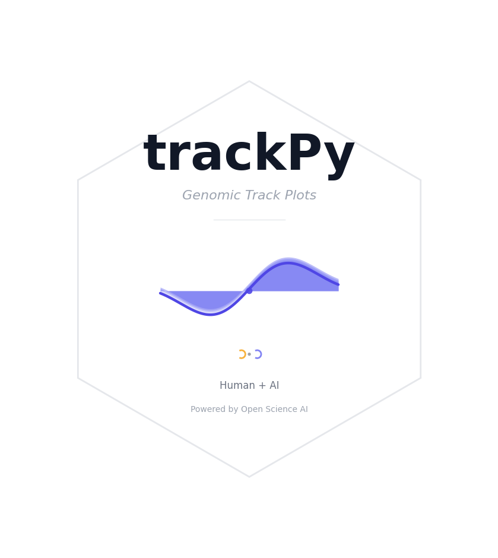

# trackPy



**Publication-quality genomic track plots from the command line.**

Pure Python bigWig & bedGraph reader + matplotlib. IGV-style color scheme.
Faceted and isoform plots with chromosome ideogram and zoom indicators.

> 🧬 **About this project** — trackPy is a self-directed project developed with the
> assistance of **Open Science AI** (Claude Code). Every feature, from the pure-Python
> bigWig parser to the IGV-style chromosome ideogram with trapezoid zoom indicators,
> was conceived, designed, and iteratively refined through human-AI collaboration.
> This project stands as a demonstration of how AI-assisted development can empower
> individual researchers to build production-quality bioinformatics tools.

## Installation

```bash
# From GitHub (recommended)
pip install git+https://github.com/junjunlab/trackPy.git

# Or clone and install locally
git clone https://github.com/junjunlab/trackPy.git
cd trackPy
pip install -e .
```

Requires Python >= 3.9, numpy, matplotlib.

**GitHub:** [https://github.com/junjunlab/trackPy](https://github.com/junjunlab/trackPy)

## Quick Start

```bash
# Info & query
trackpy info data/ip.bw
trackpy query data/ip.bw chr7:10900000-11000000

# Faceted with chromosome ideogram
trackpy plot faceted Zscan4b Zscan4c Zscan4d Zscan4e Zscan4f \
  -g genes.gff3.gz -b in1.bw in2.bw ip1.bw ip2.bw \
  -l In1 In2 IP1 IP2 \
  --cytoband mm10_cytoBandIdeo.txt.gz --show-box -o out

# BedGraph ATAC-seq
trackpy plot faceted Actb Myc -g genes.gff3.gz \
  -b wt.bedgraph.gz ko.bedgraph.gz -l WT KO \
  --track-colors "#3498DB" "#E74C3C" -o out

# Region-based faceted (auto-detects genes in intervals)
trackpy plot faceted chr14:54835580-55001465 chr7:73025897-76116527 \
  -g genes.gtf -b in.bw ip.bw -l Input IP -o out

# Region-based IGV-style isoform view
trackpy plot regions chr14:54835580-55001465 chr7:73025897-76116527 \
  -g genes.gtf -b in.bw ip.bw -l Input IP -o out --show-box
```

## Commands

| Command | Description |
|---------|-------------|
| `trackpy info <file.bw>` | Chromosome names and sizes |
| `trackpy query <file.bw> <region>` | Dump signal (region: `chr:start-end`) |
| `trackpy plot faceted <genes\|regions...> [opts]` | Multi-gene/region side-by-side |
| `trackpy plot isoforms <genes...> [opts]` | All transcripts with IDs |
| `trackpy plot regions <chr:start-end ...> [opts]` | Region-based IGV-style isoform view |

## Parameters

### Input / Output
| Flag | Default | Description |
|------|---------|-------------|
| `-g, --gtf` | required | GTF or GFF3 (`.gz` supported, auto-detected) |
| `-b, --bw-files` | required | BigWig (`.bw`) or bedGraph (`.bedgraph`, `.bedgraph.gz`), auto-detected |
| `-l, --labels` | filename | Display label per track |
| `-o, --output` | `trackpy_output` | Output file base name |

### Layout
| Flag | Default | Description |
|------|---------|-------------|
| `--flank-up` | 3000 | bp upstream of gene start |
| `--flank-down` | 3000 | bp downstream of gene end |
| `--wspace` | auto | Horizontal gap between columns |
| `--width` | 14 / 15 | Figure width in inches (faceted/isoforms) |
| `--height` | 6.5 / 8 | Figure height in inches |
| `--gene-model-top` | off | Place gene model above signals |
| `--no-coords` | off | Hide coordinate header |
| `--show-box` | off | Show border on all 4 sides of each track |
| `--gene-ratio` | 0.8 | Gene model panel height relative to signal track |

### Gene Model
| Flag | Default | Description |
|------|---------|-------------|
| `--utr-ratio` | 0.5 | UTR height / CDS height |
| `--cds-color` | `#1A1A1A` | CDS color |
| `--utr-color` | `#1A1A1A` | UTR color |
| `--intron-color` | `#1A1A1A` | Intron line color |

### Isoform
| Flag | Default | Description |
|------|---------|-------------|
| `--isoform-height` | 0.35 | Row height |
| `--isoform-label-pos` | bottom | Label position: left/right/top/bottom |
| `--isoform-label-size` | 6 | Label font size |
| `--no-isoform-label` | off | Hide transcript ID labels |
| `--isoform-align` | top | Row alignment: top/center/bottom |

### Y-Axis
| Flag | Default | Description |
|------|---------|-------------|
| `--ymax` | auto (99%) | Fixed y-axis ceiling |
| `--yscale` | gene | gene (shared per gene) or track (independent) |
| `--ymax-pos` | 0.95 0.95 | Range label position in axes coords |
| `--ymax-label-size` | 8 | Range label font size |
| `--no-range-label` | off | Hide [0-xxx] label |
| `--no-yticks` | off | Hide y-axis ticks and values |

### Track Colors
| Flag | Default | Description |
|------|---------|-------------|
| `--track-colors` | auto | One HEX per `-b` file |

### Highlights
| Flag | Default | Description |
|------|---------|-------------|
| `--highlight` | — | `REGION COLOR`, e.g. `chr5:142904000-142905000 "#FF000020"`. Repeatable. |

### Chromosome Ideogram
| Flag | Default | Description |
|------|---------|-------------|
| `--cytoband` | — | Path to cytoband file (`.gz` supported) |
| `--trap-color` | `#E0E0E0 #404040` | Trapezoid gradient: TOP_COLOR BOTTOM_COLOR |
| `--trap-height` | 2.5 | Trapezoid height |
| `--trap-smooth` | 200 | Trapezoid gradient steps, higher = smoother |
| `--marker-size` | 0.01 | Red triangle marker size on cytoband |
| `--cytoband-height` | 0.6 | Chromosome panel height |

### Zoom (all modes)
| Flag | Default | Description |
|------|---------|-------------|
| `--zoom-region` | — | Sub-region(s) to magnify. Comma-separated, one per gene/region. Regions mode: `chr:start-end`. E.g. `--zoom-region "chr14:54940000-54960000,chr19:5795000-5797000"` |
| `--zoom-position` | `bottom` | Zoom panel position: `bottom` (full above, zoom below) or `top` (zoom above, full below) |

## Python API

```python
from trackpy import (
    BigWigReader, BedGraphReader, parse_annotations, load_gene_data,
    parse_regions, parse_faceted_regions,
    plot_faceted, plot_isoforms, plot_isoforms_regions, IGV_COLORS
)
# Gene-name based
genes = parse_annotations("genes.gff3.gz", ["Zscan4b", "Myc"])
data = load_gene_data(genes, {"Input":"in.bw","IP":"ip.bw"})
plot_faceted(genes, data, ["Input","IP"], data, IGV_COLORS, "out.pdf",
             cytoband="mm10_cytoBandIdeo.txt.gz")

# Region-based
regions = parse_regions("genes.gtf", [("7", 10900000, 11000000, "chr7:10.9-11.0Mb")])
plot_isoforms_regions(regions, data, ["Input","IP"], ..., "out.pdf")
```

## Documentation

- **[User Guide](USER_GUIDE.md)** — Full manual with examples, recipes, and screenshots
- **[API Reference](API_REFERENCE.md)** — Complete parameter and function reference

## License

MIT
