# trackPy User Guide

> **v0.1.5.1** — Publication-quality genomic track plots from the command line.

[GitHub](https://github.com/junjunlab/trackPy) | [API Reference](API_REFERENCE.md)

---

## 1. Installation

```bash
pip install git+https://github.com/junjunlab/trackPy.git
# or
git clone https://github.com/junjunlab/trackPy.git && cd trackPy && pip install -e .
```

Requirements: Python >= 3.9, numpy >= 1.20, matplotlib >= 3.5.

---

## 2. Plot Modes

trackPy provides three plot modes: `faceted`, `isoforms`, and `regions`.

### 2.1 `faceted` — Multi-Gene Side-by-Side

One column per gene. Signal tracks + collapsed gene model + optional chromosome ideogram.

```bash
trackpy plot faceted Zscan4c Zscan4d Zscan4e Zscan4f \
  -g demo/testdata/Mus_musculus.GRCm38.102.gtf.gz \
  -b demo/testdata/GSM5746910_MS_2cell_Input_rep1.bigWig \
     demo/testdata/GSM5746911_MS_2cell_Input_rep2.bigWig \
     demo/testdata/GSM5746912_MS_2cell_IP_rep1.bigWig \
     demo/testdata/GSM5746913_MS_2cell_IP_rep2.bigWig \
  -l "Input rep1" "Input rep2" "IP rep1" "IP rep2" \
  --cytoband demo/cytoband/mm10_cytoBandIdeo.txt.gz --show-box -o out
```

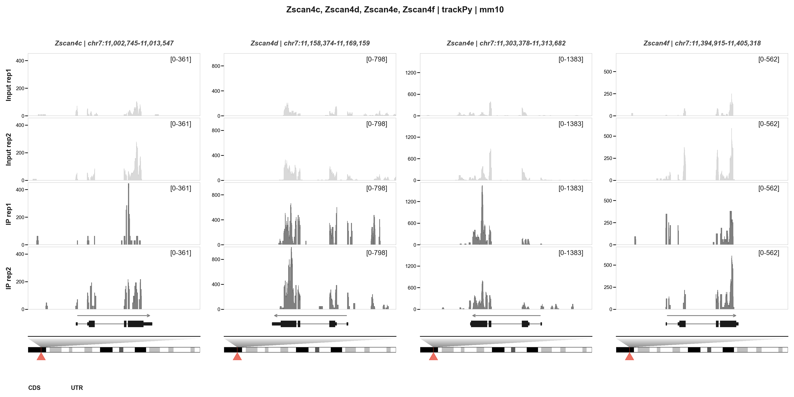

### 2.2 `isoforms` — All Transcripts per Gene

Each column = one gene. All transcripts shown as individual rows. Strand arrows on intron lines.

```bash
trackpy plot isoforms Myh6 Myh7 Bcl2l2 Pabpn1 \
  -g demo/testdata/Mus_musculus.GRCm38.102.gtf.gz \
  -b demo/testdata/GSM5746910_MS_2cell_Input_rep1.bigWig \
     demo/testdata/GSM5746911_MS_2cell_Input_rep2.bigWig \
     demo/testdata/GSM5746912_MS_2cell_IP_rep1.bigWig \
     demo/testdata/GSM5746913_MS_2cell_IP_rep2.bigWig \
  -l "Input rep1" "Input rep2" "IP rep1" "IP rep2" --show-box -o out
```

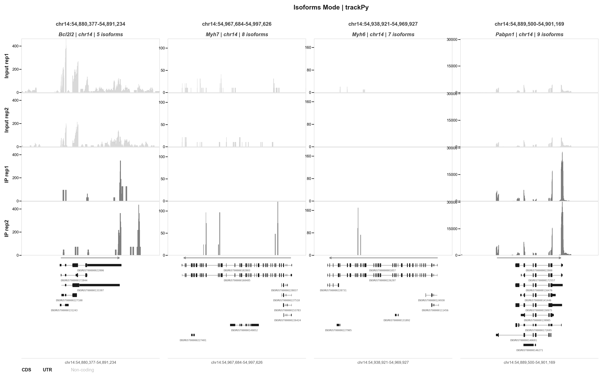

### 2.3 `regions` — IGV-Style Region Browser

Specify genomic intervals (`chr:start-end`). All overlapping transcripts are found and packed IGV-style: non-overlapping transcripts share the same row.

```bash
trackpy plot regions chr14:54835580-55001465 \
  -g demo/testdata/Mus_musculus.GRCm38.102.gtf.gz \
  -b demo/testdata/GSM5746910_MS_2cell_Input_rep1.bigWig \
     demo/testdata/GSM5746911_MS_2cell_Input_rep2.bigWig \
     demo/testdata/GSM5746912_MS_2cell_IP_rep1.bigWig \
     demo/testdata/GSM5746913_MS_2cell_IP_rep2.bigWig \
  -l "Input rep1" "Input rep2" "IP rep1" "IP rep2" --show-box -o out
```

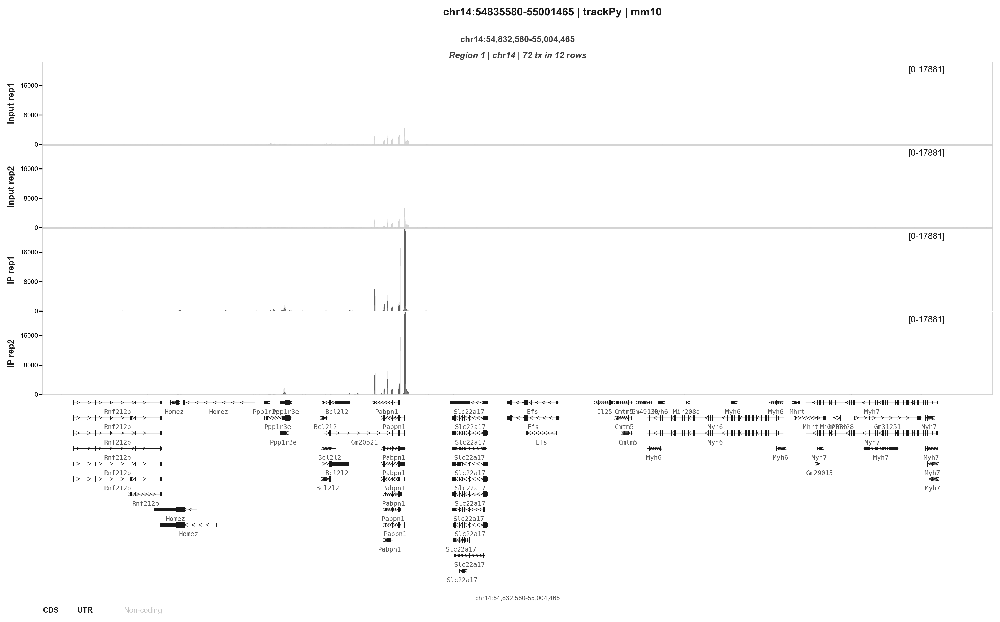

---

## 3. Zoom — Magnify Sub-Regions

Add `--zoom-region` to create a zoom-in panel for each gene. Works in `faceted` and `isoforms` modes (gene-name input). Full gene view + zoomed region stacked vertically, connected by a gradient trapezoid.

**`--zoom-region`**: Comma-separated `START-END` pairs, one per gene. Single value applies to all genes.
**`--zoom-position`**: `bottom` (default, full above) or `top` (zoom above).

### 3.1 Faceted Zoom

```bash
trackpy plot faceted Zscan4b Zscan4c \
  -g demo/testdata/Mus_musculus.GRCm38.102.gtf.gz \
  -b demo/testdata/GSM5746910_MS_2cell_Input_rep1.bigWig \
     demo/testdata/GSM5746911_MS_2cell_Input_rep2.bigWig \
     demo/testdata/GSM5746912_MS_2cell_IP_rep1.bigWig \
     demo/testdata/GSM5746913_MS_2cell_IP_rep2.bigWig \
  -l "Input rep1" "Input rep2" "IP rep1" "IP rep2" \
  --zoom-region "10901818-10903972,11007346-11008946" --show-box -o out
```

| `--zoom-position bottom` (default) | `--zoom-position top` |
|---|---|
| 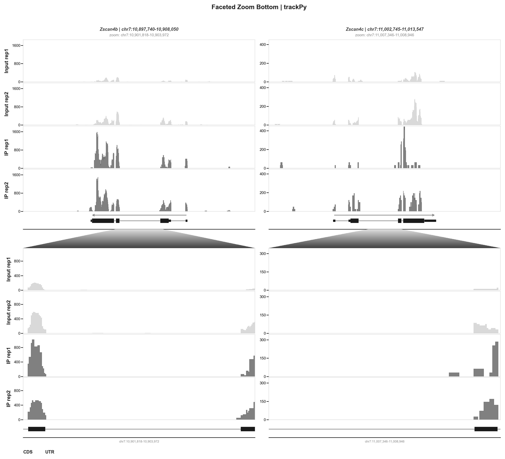 | 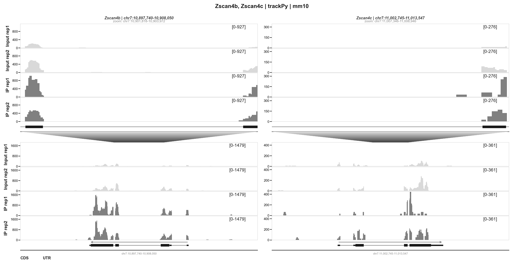 |

### 3.2 Isoforms Zoom

```bash
trackpy plot isoforms Myh6 Myh7 Bcl2l2 \
  -g demo/testdata/Mus_musculus.GRCm38.102.gtf.gz \
  -b ... -l "Input rep1" "Input rep2" "IP rep1" "IP rep2" \
  --zoom-region "54945000-54960000,54975000-54990000,54885000-54888000" \
  --trap-color "#3498DB" "#2980B9" --show-box -o out
```

| `--zoom-position bottom` | `--zoom-position top` |
|---|---|
| 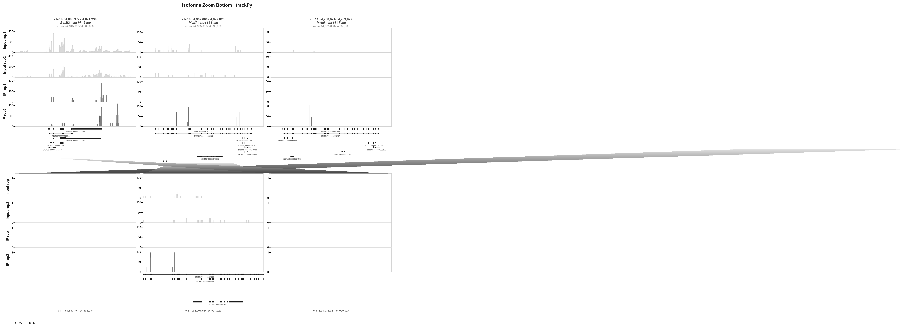 | 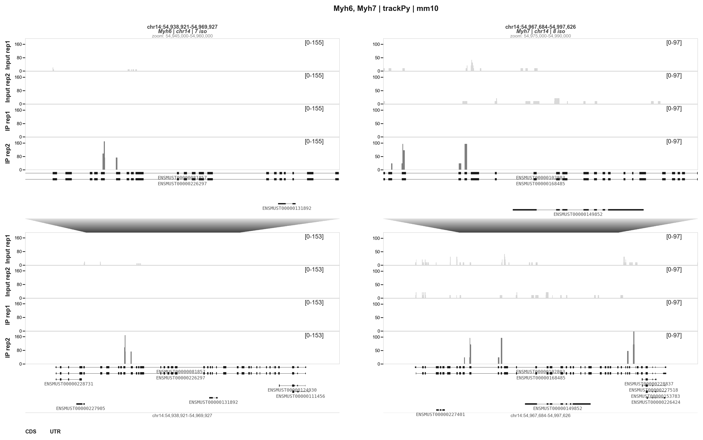 |

---

## 4. Parameter Showcase

### 4.1 `--cytoband` — Chromosome Ideogram

Adds IGV-standard chromosome ideogram with Giemsa cytoband coloring, red gene position marker with triangle, and gray gradient trapezoid.

```bash
# Without --cytoband
trackpy plot faceted Zscan4b Zscan4c -g genes.gtf \
  -b in1.bw in2.bw ip1.bw ip2.bw -l In1 In2 IP1 IP2 --show-box -o out

# With --cytoband
trackpy plot faceted Zscan4b Zscan4c -g genes.gtf \
  -b in1.bw in2.bw ip1.bw ip2.bw -l In1 In2 IP1 IP2 \
  --cytoband mm10_cytoBandIdeo.txt.gz --show-box -o out
```

| Off | On |
|-----|-----|
| 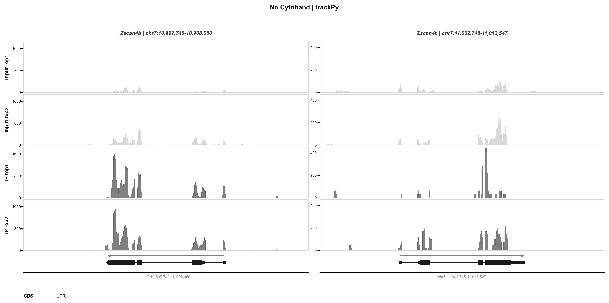 | 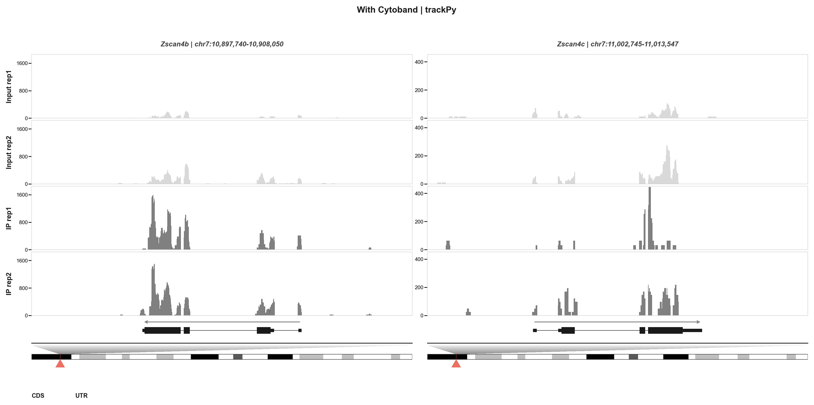 |

### 4.2 `--show-box` — Track Borders

Draws borders on all 4 sides of each signal track panel.

```bash
# Without (default)
trackpy plot faceted Zscan4b Zscan4c -g genes.gtf \
  -b in1.bw in2.bw ip1.bw ip2.bw -l In1 In2 IP1 IP2 \
  --cytoband mm10_cytoBandIdeo.txt.gz -o out

# With --show-box
trackpy plot faceted Zscan4b Zscan4c -g genes.gtf \
  -b in1.bw in2.bw ip1.bw ip2.bw -l In1 In2 IP1 IP2 \
  --cytoband mm10_cytoBandIdeo.txt.gz --show-box -o out
```

| Off | On |
|-----|-----|
|  | 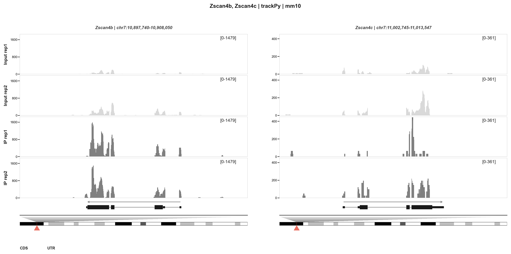 |

### 4.3 `--gene-model-top` — Gene Model Position

Places the gene model above signal tracks instead of below.

```bash
trackpy plot faceted Zscan4b Zscan4c Zscan4d \
  -g genes.gtf -b in1.bw in2.bw ip1.bw ip2.bw -l In1 In2 IP1 IP2 \
  --cytoband mm10_cytoBandIdeo.txt.gz --show-box --gene-model-top -o out
```

| Bottom (default) | Top |
|---|---|
|  | 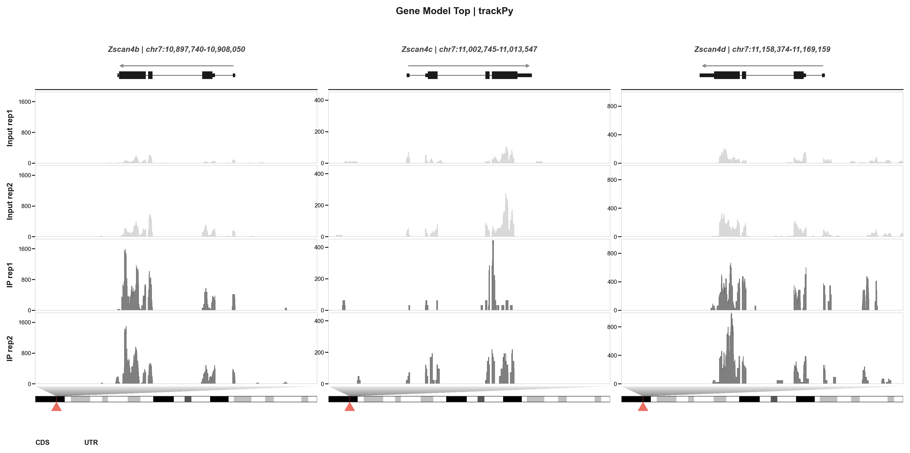 |

### 4.4 `--gene-ratio` — Gene Model Panel Height

Controls the gene model row height relative to signal tracks. Default: `0.8`. Larger = taller gene model.

```bash
trackpy plot faceted Zscan4b Zscan4c -g genes.gtf \
  -b in1.bw in2.bw ip1.bw ip2.bw -l In1 In2 IP1 IP2 \
  --gene-ratio 1.5 --show-box -o out
```

| `--gene-ratio 0.8` (default) | `--gene-ratio 1.5` |
|---|---|
|  | 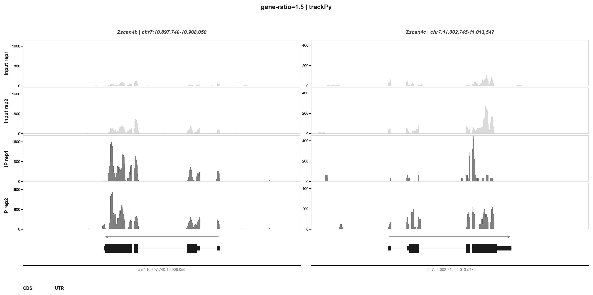 |

### 4.5 `--yscale` — Y-Axis Scale Mode

- `gene` (default): All tracks per gene share the same y-axis maximum.
- `track`: Each track has an independent y-axis scale.

```bash
trackpy plot faceted Zscan4b Zscan4c -g genes.gtf \
  -b in1.bw in2.bw ip1.bw ip2.bw -l In1 In2 IP1 IP2 \
  --yscale track --show-box -o out
```

| `gene` (default) | `track` (independent) |
|---|---|
|  |  |

### 4.6 `--no-yticks` / `--no-range-label` — Compact Mode

Hides y-axis ticks and `[0-xxx]` range labels for a clean, compact layout.

```bash
trackpy plot faceted Zscan4b Zscan4c Zscan4d \
  -g genes.gtf -b in1.bw in2.bw ip1.bw ip2.bw -l In1 In2 IP1 IP2 \
  --cytoband mm10_cytoBandIdeo.txt.gz --show-box --no-yticks --no-range-label -o out
```

| Normal | Compact |
|---|---|
| 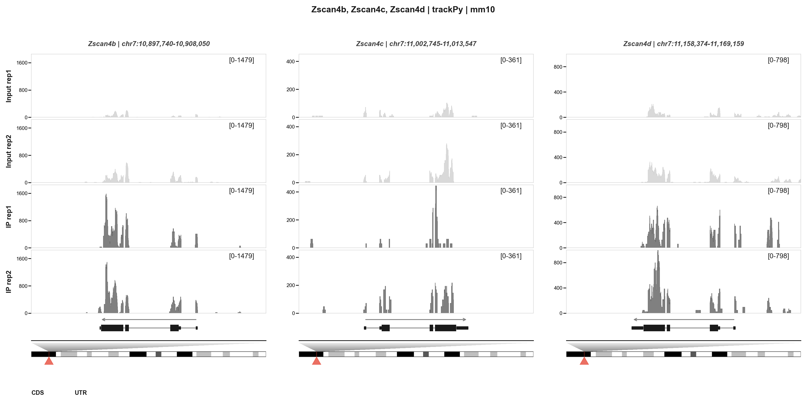 | 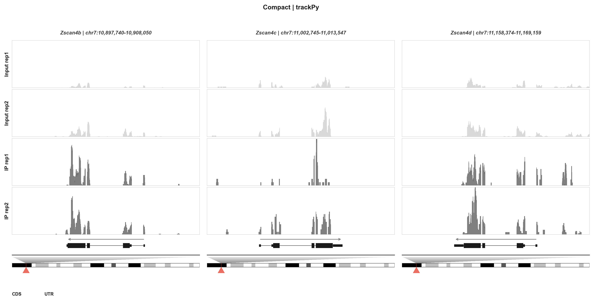 |

### 4.7 `--track-colors` — Custom Signal Colors

Override the default IGV-style Input/IP color scheme. One HEX color per `-b` file.

```bash
trackpy plot faceted Zscan4b Zscan4c -g genes.gtf \
  -b in1.bw in2.bw ip1.bw ip2.bw -l In1 In2 IP1 IP2 \
  --cytoband mm10_cytoBandIdeo.txt.gz --show-box \
  --track-colors "#3498DB" "#2980B9" "#E74C3C" "#C0392B" -o out
```

| Default IGV colors | Custom colors |
|---|---|
|  | 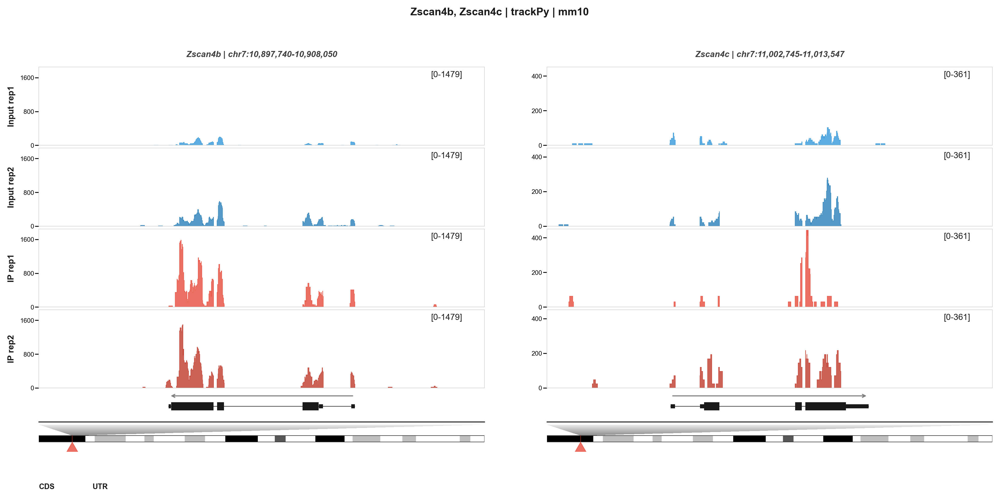 |

> Default auto-detection: labels containing "IP" or "m6A" get dark fill; others get light gray.

### 4.8 `--flank-up` / `--flank-down` — View Padding

Control the genomic context around genes. Default: `3000` bp each side.

```bash
trackpy plot faceted Zscan4b -g genes.gtf \
  -b in1.bw in2.bw ip1.bw ip2.bw -l In1 In2 IP1 IP2 \
  --cytoband mm10_cytoBandIdeo.txt.gz --show-box \
  --flank-up 10000 --flank-down 10000 -o out
```

| flank=3000 (default) | flank=10000 |
|---|---|
| 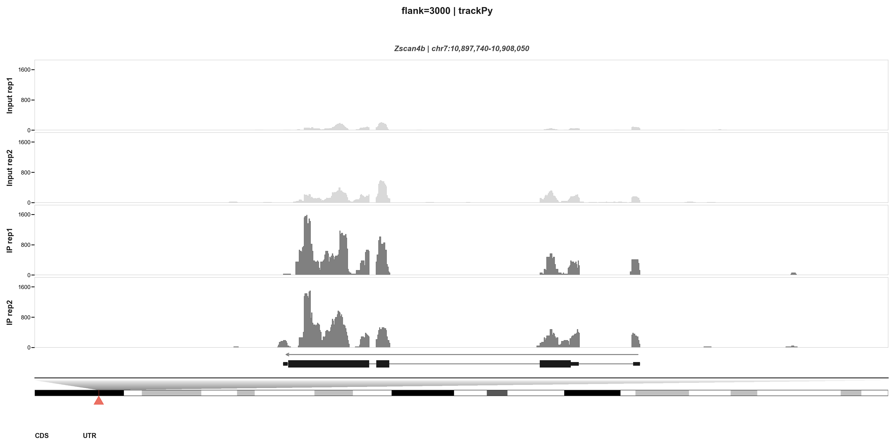 | 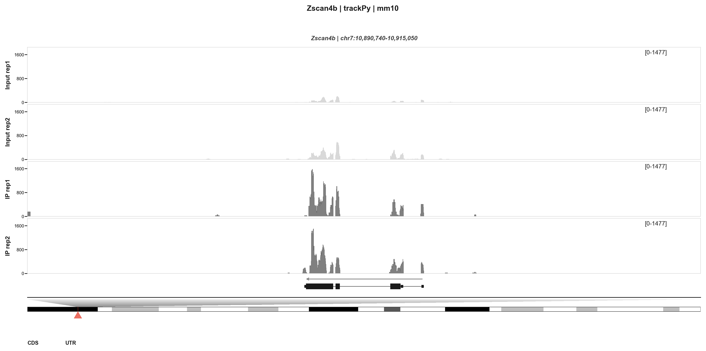 |

### 4.9 `--isoform-label-pos` — Transcript Label Position

Control where transcript IDs appear in isoforms mode. Options: `bottom` (default), `left`, `right`, `top`.

```bash
trackpy plot isoforms Myh6 Myh7 -g genes.gtf \
  -b in1.bw in2.bw ip1.bw ip2.bw -l In1 In2 IP1 IP2 \
  --isoform-label-pos left --show-box -o out
```

| `bottom` (default) | `left` |
|---|---|
| 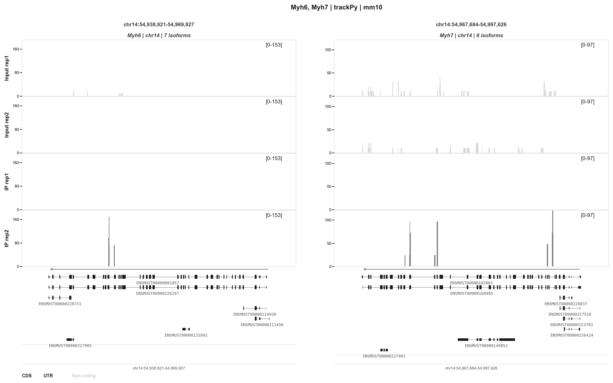 | 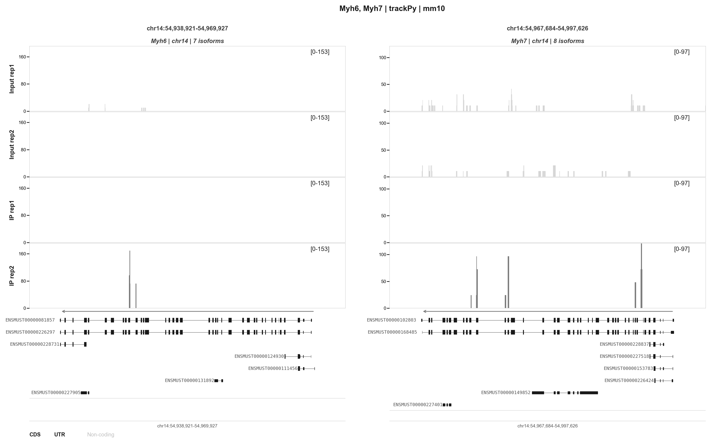 |

### 4.10 `--highlight` — Region Highlights

Add semi-transparent vertical spans to mark regions of interest. Repeatable. Chromosome-filtered via `chr:start-end`.

```bash
trackpy plot faceted Zscan4b Zscan4c -g genes.gtf \
  -b in1.bw in2.bw ip1.bw ip2.bw -l In1 In2 IP1 IP2 \
  --cytoband mm10_cytoBandIdeo.txt.gz --show-box \
  --highlight 10904000-10905000 "#FF000020" \
  --highlight 11008000-11010000 "#0000FF20" -o out
```

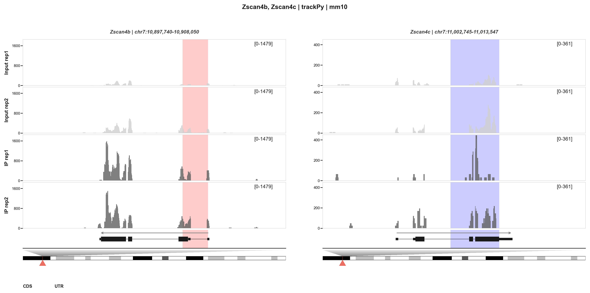

### 4.11 `--trap-color` / `--trap-height` / `--marker-size` — Cytoband Trapezoid

Customize the gradient trapezoid above the chromosome ideogram and the red gene marker.

```bash
trackpy plot faceted Zscan4b Zscan4c -g genes.gtf \
  -b in1.bw in2.bw ip1.bw ip2.bw -l In1 In2 IP1 IP2 \
  --cytoband mm10_cytoBandIdeo.txt.gz --show-box \
  --trap-color "#3498DB" "#2980B9" --trap-height 3.5 --marker-size 0.02 -o out
```

| Default | Custom |
|---|---|
|  | 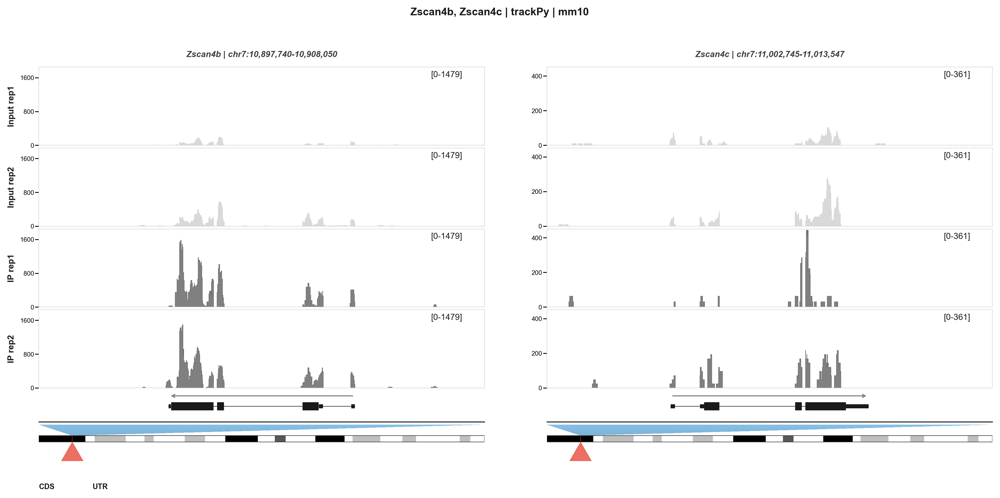 |

---

## 5. Complete Parameter Reference

### Input / Output
| Flag | Default | Description |
|------|---------|-------------|
| `-g, --gtf` | required | GTF or GFF3 (`.gz` OK, auto-detected) |
| `-b, --bw-files` | required | bigWig or bedGraph (auto-detected by extension) |
| `-l, --labels` | filename | Display label per `-b` file |
| `-o, --output` | `trackpy_output` | Output PDF base name |

### Layout
| Flag | Default | Description |
|------|---------|-------------|
| `--flank-up` | `3000` | bp upstream of gene start |
| `--flank-down` | `3000` | bp downstream of gene end |
| `--width` | `14` / `15` | Figure width (faceted / isoforms&regions) |
| `--height` | `6.5` / `8` | Figure height |
| `--gene-model-top` | off | Gene model above signal tracks |
| `--no-coords` | off | Hide coordinate header |
| `--show-box` | off | Border on all 4 sides of each track |
| `--gene-ratio` | `0.8` | Gene model height relative to signal track |
| `--wspace` | auto | Horizontal gap between columns |

### Gene Model
| Flag | Default | Description |
|------|---------|-------------|
| `--utr-ratio` | `0.5` | UTR height / CDS height |
| `--cds-color` | `#1A1A1A` | CDS fill |
| `--utr-color` | `#1A1A1A` | UTR fill |
| `--intron-color` | `#1A1A1A` | Intron line |

### Isoform
| Flag | Default | Description |
|------|---------|-------------|
| `--isoform-height` | `0.35` | Row height |
| `--isoform-label-pos` | `bottom` | `left` / `right` / `top` / `bottom` |
| `--isoform-label-size` | `6` | Label font size |
| `--no-isoform-label` | off | Hide transcript labels |
| `--isoform-align` | `top` | `top` / `center` / `bottom` |

### Y-Axis
| Flag | Default | Description |
|------|---------|-------------|
| `--ymax` | auto (99%) | Fixed y-axis ceiling |
| `--yscale` | `gene` | `gene` (shared) or `track` (independent) |
| `--ymax-pos` | `0.95 0.95` | Range label position |
| `--ymax-label-size` | `8` | Range label font size |
| `--no-range-label` | off | Hide `[0-xxx]` labels |
| `--no-yticks` | off | Hide y-axis ticks |

### Cytoband Trapezoid
| Flag | Default | Description |
|------|---------|-------------|
| `--cytoband` | — | Path to cytoband file (`.gz` OK) |
| `--trap-color` | `#E0E0E0 #404040` | Trapezoid gradient: TOP BOTTOM |
| `--trap-height` | `2.5` | Trapezoid height |
| `--trap-smooth` | `200` | Gradient steps (higher = smoother) |
| `--marker-size` | `0.01` | Red triangle marker size |
| `--cytoband-height` | `0.6` | Chromosome panel height |

### Zoom
| Flag | Default | Description |
|------|---------|-------------|
| `--zoom-region` | — | `START-END` pairs, comma-separated, one per gene |
| `--zoom-position` | `bottom` | `bottom` or `top` |

### Other
| Flag | Default | Description |
|------|---------|-------------|
| `--track-colors` | auto | One HEX per `-b` file |
| `--highlight` | — | `REGION COLOR`, repeatable |

---

## 6. Python API

```python
from trackpy import (
    BigWigReader, BedGraphReader,
    parse_annotations, load_gene_data,
    parse_regions, parse_faceted_regions,
    plot_faceted, plot_isoforms, plot_isoforms_regions,
    IGV_COLORS,
)
from trackpy.plot_zoom import plot_faceted_zoom, plot_isoforms_zoom

# Gene-name based
genes = parse_annotations("genes.gtf.gz", ["Zscan4b", "Myc"])
data = load_gene_data(genes, {"Input": "in.bw", "IP": "ip.bw"})
plot_faceted(genes, data, ["Input", "IP"], data, IGV_COLORS,
             "out.pdf", cytoband="mm10_cytoBandIdeo.txt.gz", show_box=True)

# Region-based
regions = [("7", 10900000, 11000000, "chr7:10.9-11.0Mb")]
rdata = parse_regions("genes.gtf.gz", regions)
plot_isoforms_regions(rdata, data, ["Input", "IP"], {}, IGV_COLORS,
                      "out.pdf", show_box=True)

# Zoom
plot_faceted_zoom(genes, data, [(10903000, 10905000)],
                  ["Input", "IP"], {}, IGV_COLORS, "out.pdf")
plot_isoforms_zoom(genes, data, [(10903000, 10905000)],
                   ["Input", "IP"], {}, IGV_COLORS, "out.pdf")

# Low-level I/O
with BigWigReader("signal.bw") as bw:
    values = bw.query("chr7", 10900000, 11000000)
```

---

## License

MIT — [https://github.com/junjunlab/trackPy](https://github.com/junjunlab/trackPy)
