# trackPy User Guide

> **v0.1.5** — Publication-quality genomic track plots from the command line.

---

## Table of Contents

1. [Installation](#1-installation)
2. [Quick Start](#2-quick-start)
3. [Core Concepts](#3-core-concepts)
4. [Commands Reference](#4-commands-reference)
5. [Plot Modes](#5-plot-modes)
6. [Parameters in Detail](#6-parameters-in-detail)
7. [Parameters Quick Reference](#7-parameters-quick-reference)
8. [Recipes](#8-recipes)
9. [Python API](#9-python-api)

---

## 1. Installation

```bash
# From GitHub (recommended)
pip install git+https://github.com/junjunlab/trackPy.git

# Or clone and install locally
git clone https://github.com/junjunlab/trackPy.git
cd trackPy
pip install -e .
```

**Requirements:** Python >= 3.9, numpy >= 1.20, matplotlib >= 3.5

---

## 2. Quick Start

### 2.1 Check your data

```bash
# List chromosomes in a bigWig file
trackpy info demo/testdata/GSM5746912_MS_2cell_IP_rep1.bigWig

# Query signal values in a region
trackpy query demo/testdata/GSM5746912_MS_2cell_IP_rep1.bigWig chr7:10900000-10901000
```

**Output:**
```
File: demo/testdata/GSM5746912_MS_2cell_IP_rep1.bigWig
Chromosomes: 22
  chr1: 195,471,971 bp
  chr7: 145,441,459 bp
  ...
```

### 2.2 Your first plot

```bash
trackpy plot faceted Zscan4c Zscan4d Zscan4e Zscan4f \
  -g demo/testdata/Mus_musculus.GRCm38.102.gtf.gz \
  -b demo/testdata/GSM5746910_MS_2cell_Input_rep1.bigWig \
     demo/testdata/GSM5746911_MS_2cell_Input_rep2.bigWig \
     demo/testdata/GSM5746912_MS_2cell_IP_rep1.bigWig \
     demo/testdata/GSM5746913_MS_2cell_IP_rep2.bigWig \
  -l "Input rep1" "Input rep2" "IP rep1" "IP rep2" \
  --cytoband demo/cytoband/mm10_cytoBandIdeo.txt.gz \
  --show-box -o zscan4_family
```

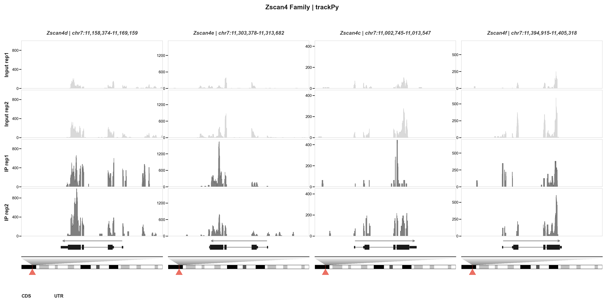

### 2.3 Region-based plot (IGV-style isoform browser)

```bash
trackpy plot regions chr14:54835580-55001465 \
  -g demo/testdata/Mus_musculus.GRCm38.102.gtf.gz \
  -b demo/testdata/GSM5746910_MS_2cell_Input_rep1.bigWig \
     demo/testdata/GSM5746911_MS_2cell_Input_rep2.bigWig \
     demo/testdata/GSM5746912_MS_2cell_IP_rep1.bigWig \
     demo/testdata/GSM5746913_MS_2cell_IP_rep2.bigWig \
  -l "Input rep1" "Input rep2" "IP rep1" "IP rep2" \
  --show-box -o regions_demo
```

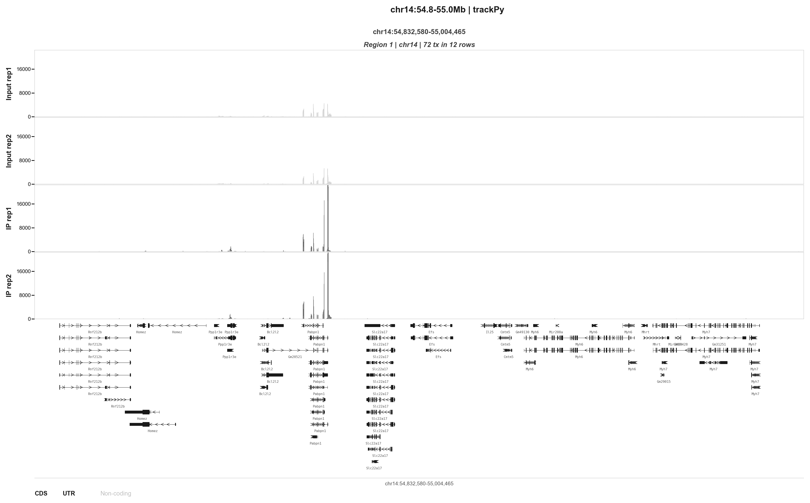

### 2.4 Faceted region view (collapsed gene models per interval)

```bash
trackpy plot faceted chr14:54835580-55001465 chr7:73025897-76116527 \
  -g demo/testdata/Mus_musculus.GRCm38.102.gtf.gz \
  -b demo/testdata/GSM5746910_MS_2cell_Input_rep1.bigWig \
     demo/testdata/GSM5746911_MS_2cell_Input_rep2.bigWig \
     demo/testdata/GSM5746912_MS_2cell_IP_rep1.bigWig \
     demo/testdata/GSM5746913_MS_2cell_IP_rep2.bigWig \
  -l "Input rep1" "Input rep2" "IP rep1" "IP rep2" \
  --show-box -o faceted_regions
```

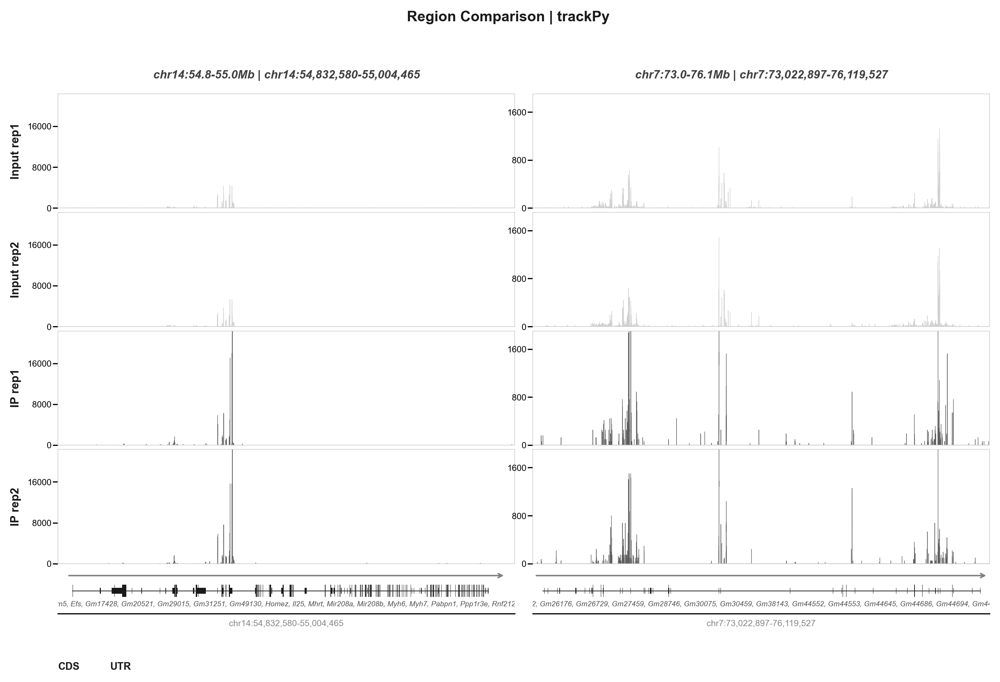

---

## 3. Core Concepts

### 3.1 Input Files

| Type | Format | Extension | Description |
|------|--------|-----------|-------------|
| **Signal** | bigWig | `.bw`, `.bigwig` | Binary indexed signal track |
| **Signal** | bedGraph | `.bedgraph`, `.bedgraph.gz` | Text-based signal track |
| **Annotation** | GTF | `.gtf`, `.gtf.gz` | Gene/transcript annotations |
| **Annotation** | GFF3 | `.gff3`, `.gff3.gz` | Gene/transcript annotations |
| **Cytoband** | TSV | `.txt.gz` | Chromosome ideogram data |

> All formats are **auto-detected** by file extension. GTF vs GFF3 is also auto-detected.

### 3.2 Plot Modes

```
┌──────────────────────────────────────────────────────┐
│  faceted          isoforms           regions         │
│  ┌──┬──┬──┐      ┌──┬──┬──┐        ┌──┬──┬──┐      │
│  │G1│G2│G3│      │G1│G2│G3│        │R1│R2│R3│      │
│  ├──┼──┼──┤      ├──┼──┼──┤        ├──┼──┼──┤      │
│  │▄▄│▄▄│▄▄│      │▄▄│▄▄│▄▄│        │▄▄│▄▄│▄▄│      │
│  │▄▄│▄▄│▄▄│      │▄▄│▄▄│▄▄│        │▄▄│▄▄│▄▄│      │
│  ├──┼──┼──┤      ├──┼──┼──┤        ├──┼──┼──┤      │
│  │▬▬│▬▬│▬▬│      │▬▬│▬▬│▬▬│        │▬▬│▬▬│▬▬│ ← tx │
│  └──┴──┴──┘      │▬▬│▬▬│▬▬│        │▬▬│   │▬▬│      │
│  1 gene/column    │▬▬│   │▬▬│        │▬▬│   │▬▬│      │
│                   1 gene/column      └──┴──┴──┘      │
│                   all transcripts     1 region/column │
│                                       packed rows     │
└──────────────────────────────────────────────────────┘
```

### 3.3 Auto-Detection in Faceted Mode

The `faceted` mode intelligently detects input type:

| Input Pattern | Mode | Behavior |
|---------------|------|----------|
| `Myc Actb` (no `:`) | Gene-name | One column per gene, canonical transcript |
| `chr7:10Mb-11Mb` (has `:`) | Region | One column per region, all genes collapsed |

---

## 4. Commands Reference

### `trackpy info`
```
trackpy info <file.bw>
```
Print chromosome names and sizes from a bigWig file.

### `trackpy query`
```
trackpy query <file.bw> <region> [-o out.txt]
```
Dump signal values for a genomic region.
- `region`: format `chr:start-end` (e.g., `chr7:10900000-11000000`)
- `-o`: save to file instead of stdout

### `trackpy plot`
```
trackpy plot <mode> <items...> [options]
```
Generate publication-quality PDF track plots.
- `mode`: `faceted` | `isoforms` | `regions`
- `items`: gene names or `chr:start-end` regions

---

## 5. Plot Modes

### 5.1 `faceted` — Multi-Gene/Multi-Region Side-by-Side

Each column = one gene or one genomic region. Gene models shown as single collapsed row.

**Gene-name mode:**
```bash
trackpy plot faceted Myc Jun Actb \
  -g demo/testdata/Mus_musculus.GRCm38.102.gtf.gz -b demo/testdata/GSM5746910_MS_2cell_Input_rep1.bigWig \
     demo/testdata/GSM5746911_MS_2cell_Input_rep2.bigWig \
     demo/testdata/GSM5746912_MS_2cell_IP_rep1.bigWig \
     demo/testdata/GSM5746913_MS_2cell_IP_rep2.bigWig \
  -l "Input rep1" "Input rep2" "IP rep1" "IP rep2" -o out
```

**Region mode** (auto-detected when input contains `:`):
```bash
trackpy plot faceted chr14:54835580-55001465 chr7:73025897-76116527 \
  -g demo/testdata/Mus_musculus.GRCm38.102.gtf.gz -b demo/testdata/GSM5746910_MS_2cell_Input_rep1.bigWig \
     demo/testdata/GSM5746911_MS_2cell_Input_rep2.bigWig \
     demo/testdata/GSM5746912_MS_2cell_IP_rep1.bigWig \
     demo/testdata/GSM5746913_MS_2cell_IP_rep2.bigWig \
  -l "Input rep1" "Input rep2" "IP rep1" "IP rep2" -o out
```
> In region mode, all genes within each interval are collapsed into one gene model row. Gene names are displayed below the structure.

**Layout (default):**
```
┌──────────────────────────────┐
│  Gene A  │  Gene B  │ Gene C │  ← Header (gene + coordinates)
├──────────┼──────────┼────────┤
│  Signal  │  Signal  │ Signal │  ← Signal tracks
│  Track 1 │  Track 1 │ Track 1│
│  Signal  │  Signal  │ Signal │
│  Track 2 │  Track 2 │ Track 2│
├──────────┼──────────┼────────┤
│  ▬▬▬▬▬  │  ▬▬▬▬▬  │ ▬▬▬▬▬ │  ← Gene model + strand arrow
│  →       │    ←     │   →    │
├──────────┼──────────┼────────┤
│██████████│██████████│████████│  ← Chromosome ideogram (with --cytoband)
└──────────┴──────────┴────────┘
```

**With `--gene-model-top`:**
The gene model row moves above signal tracks:
```
Header → Gene Model → Signal Tracks → Cytoband
```

### 5.2 `isoforms` — All Transcripts per Gene

Each column = one gene. All transcripts shown as individual rows with IDs.

```bash
trackpy plot isoforms Myh6 Myh7 Bcl2l2 Pabpn1 \
  -g demo/testdata/Mus_musculus.GRCm38.102.gtf.gz -b demo/testdata/GSM5746910_MS_2cell_Input_rep1.bigWig \
     demo/testdata/GSM5746911_MS_2cell_Input_rep2.bigWig \
     demo/testdata/GSM5746912_MS_2cell_IP_rep1.bigWig \
     demo/testdata/GSM5746913_MS_2cell_IP_rep2.bigWig \
  -l "Input rep1" "Input rep2" "IP rep1" "IP rep2" -o out --show-box
```

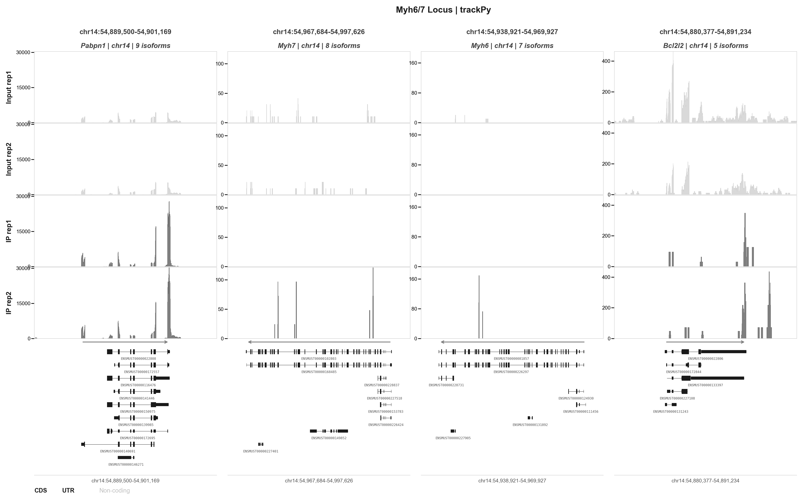

### 5.3 `regions` — IGV-Style Region Browser

Each column = one genomic region. Transcripts are **packed IGV-style**: non-overlapping transcripts share the same row to maximize space efficiency. Strand arrows on intron lines indicate transcription direction.

```bash
trackpy plot regions chr14:54835580-55001465 chr19:5790000-5810000 \
  -g demo/testdata/Mus_musculus.GRCm38.102.gtf.gz -b demo/testdata/GSM5746910_MS_2cell_Input_rep1.bigWig \
     demo/testdata/GSM5746911_MS_2cell_Input_rep2.bigWig \
     demo/testdata/GSM5746912_MS_2cell_IP_rep1.bigWig \
     demo/testdata/GSM5746913_MS_2cell_IP_rep2.bigWig \
  -l "Input rep1" "Input rep2" "IP rep1" "IP rep2" -o out --show-box
```

**Packing example:**
```
Before (72 transcripts):    After IGV packing (12 rows):
┌────┐                      ┌────┐
│ tx1│                      │tx1 │  ← non-overlapping
│ tx2│                      │ tx3│
│ tx3│                      │tx2 │  ← overlaps tx1, tx3
│ tx4│                      │tx4 │  ← non-overlapping with tx5
│ .. │                      │ .. │
│tx72│                      │tx72│
└────┘                      └────┘
 72 rows → 12 rows (83% reduction)
```

**Label display:** Shows gene name only (not transcript ID).

---

## 7. Parameters Quick Reference

> See [Section 6](#6-parameters-in-detail) for visual examples and detailed explanations of key parameters.

### Input / Output
| Flag | Default | Description |
|------|---------|-------------|
| `-g, --gtf` | **required** | Annotation file (GTF/GFF3, `.gz` OK) |
| `-b, --bw-files` | **required** | Signal files (`.bw`, `.bedgraph`, `.bedgraph.gz`) |
| `-l, --labels` | filename | Display label per track |
| `-o, --output` | `trackpy_output` | Output PDF base name |

### Layout
| Flag | Default | Description |
|------|---------|-------------|
| `--flank-up` | `3000` | bp upstream padding |
| `--flank-down` | `3000` | bp downstream padding |
| `--width` | `14` / `15` | Figure width in inches (faceted / isoforms&regions) |
| `--height` | `6.5` / `8` | Figure height in inches |
| `--gene-model-top` | off | Place gene model above signal tracks |
| `--no-coords` | off | Hide coordinate header row |
| `--show-box` | off | Show border on all 4 sides of each track |
| `--gene-ratio` | `0.8` | Gene model row height relative to signal track |
| `--wspace` | auto | Horizontal gap between columns |

### Gene Model
| Flag | Default | Description |
|------|---------|-------------|
| `--utr-ratio` | `0.5` | UTR height / CDS height |
| `--cds-color` | `#1A1A1A` | CDS fill color |
| `--utr-color` | `#1A1A1A` | UTR fill color |
| `--intron-color` | `#1A1A1A` | Intron line color |

### Isoform
| Flag | Default | Description |
|------|---------|-------------|
| `--isoform-height` | `0.35` | Row height (smaller = more compact) |
| `--isoform-label-pos` | `bottom` | Transcript label: `left` / `right` / `top` / `bottom` |
| `--isoform-label-size` | `6` | Label font size |
| `--no-isoform-label` | off | Hide transcript labels |
| `--isoform-align` | `top` | Row alignment: `top` / `center` / `bottom` |

### Y-Axis
| Flag | Default | Description |
|------|---------|-------------|
| `--ymax` | auto (99%) | Fixed y-axis ceiling |
| `--yscale` | `gene` | `gene` (shared per gene) or `track` (independent) |
| `--ymax-pos` | `0.95 0.95` | Range label position in axes coords |
| `--ymax-label-size` | `8` | Range label font size |
| `--no-range-label` | off | Hide `[0-xxx]` labels |
| `--no-yticks` | off | Hide y-axis ticks |

### Cytoband (Chromosome Ideogram)
| Flag | Default | Description |
|------|---------|-------------|
| `--cytoband` | — | Path to cytoband file (`.gz` OK) |
| `--trap-color` | `#E0E0E0 #404040` | Trapezoid gradient: TOP BOTTOM |
| `--trap-height` | `2.5` | Trapezoid height |
| `--trap-smooth` | `200` | Gradient steps (higher = smoother) |
| `--marker-size` | `0.01` | Red triangle marker size |
| `--cytoband-height` | `0.6` | Chromosome panel height |

> When `--cytoband` is enabled:
> - Full chromosome ideogram with IGV-standard Giemsa staining appears below each gene
> - Red rectangle + triangle marks the gene position
> - Gray gradient trapezoid shows the zoom relationship (panel width → gene position)

### Other
| Flag | Default | Description |
|------|---------|-------------|
| `--track-colors` | auto | One HEX color per `-b` file |
| `--highlight` | — | `REGION COLOR` (repeatable) |

---

## 6. Parameters in Detail

### 6.1 Chromosome Ideogram (`--cytoband`)

Adding `--cytoband` enables a full chromosome ideogram below each gene column with IGV-standard Giemsa staining, a red gene position marker with triangle indicator, and a gray gradient trapezoid showing the zoom relationship.

```bash
trackpy plot faceted Zscan4c Zscan4d Zscan4e Zscan4f \
  -g demo/testdata/Mus_musculus.GRCm38.102.gtf.gz -b demo/testdata/GSM5746910_MS_2cell_Input_rep1.bigWig \
     demo/testdata/GSM5746911_MS_2cell_Input_rep2.bigWig \
     demo/testdata/GSM5746912_MS_2cell_IP_rep1.bigWig \
     demo/testdata/GSM5746913_MS_2cell_IP_rep2.bigWig \
  -l "Input rep1" "Input rep2" "IP rep1" "IP rep2" \
  --cytoband demo/cytoband/mm10_cytoBandIdeo.txt.gz --show-box -o out
```


**Related parameters:**

| Flag | Default | Effect |
|------|---------|--------|
| `--cytoband-height` | `0.6` | Height of the chromosome panel. Larger = taller ideogram |
| `--trap-height` | `2.5` | Trapezoid height. Larger = taller zoom indicator |
| `--trap-color` | `#E0E0E0 #404040` | Trapezoid gradient: TOP_COLOR BOTTOM_COLOR |
| `--trap-smooth` | `200` | Number of gradient slices. Higher = smoother gradient |
| `--marker-size` | `0.01` | Red triangle marker size (figure fraction). Larger = bigger triangle |

**Custom trapezoid example:**
```bash
trackpy plot faceted Zscan4b Zscan4c -g demo/testdata/Mus_musculus.GRCm38.102.gtf.gz -b demo/testdata/GSM5746910_MS_2cell_Input_rep1.bigWig \
     demo/testdata/GSM5746911_MS_2cell_Input_rep2.bigWig \
  -l "Input rep1" "Input rep2" --cytoband demo/cytoband/mm10_cytoBandIdeo.txt.gz --show-box \
  --trap-color "#3498DB" "#2980B9" --trap-height 3.5 --marker-size 0.02 -o out
```

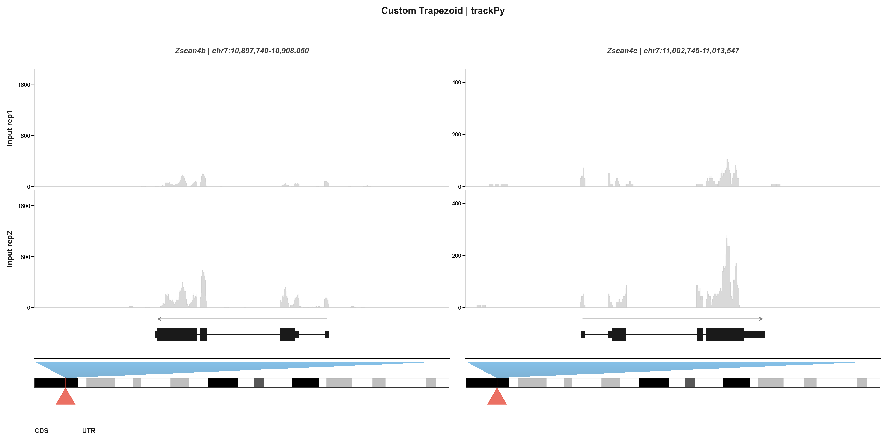

### 6.2 Highlights (`--highlight`)

Add semi-transparent vertical highlight spans to mark regions of interest. Repeatable for multiple highlights.

```bash
trackpy plot faceted Zscan4b Zscan4c -g demo/testdata/Mus_musculus.GRCm38.102.gtf.gz \
  -b demo/testdata/GSM5746910_MS_2cell_Input_rep1.bigWig \
     demo/testdata/GSM5746911_MS_2cell_Input_rep2.bigWig \
     demo/testdata/GSM5746912_MS_2cell_IP_rep1.bigWig \
     demo/testdata/GSM5746913_MS_2cell_IP_rep2.bigWig \
  -l "Input rep1" "Input rep2" "IP rep1" "IP rep2" \
  --cytoband demo/cytoband/mm10_cytoBandIdeo.txt.gz --show-box \
  --highlight 10904000-10905000 "#FF000020" \
  --highlight 11008000-11010000 "#0000FF20" -o out
```

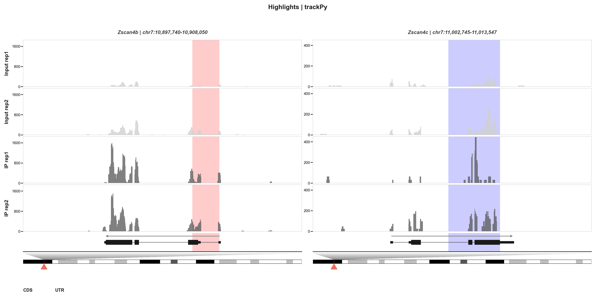

> Format: `REGION COLOR`. Region can be `start-end` (genome-wide) or `chr:start-end` (chromosome-specific). Color should include alpha (e.g., `#FF000020`).

### 6.3 Track Colors (`--track-colors`)

Override the default IGV-style Input/IP color scheme with custom colors.

```bash
trackpy plot faceted Zscan4b Zscan4c -g demo/testdata/Mus_musculus.GRCm38.102.gtf.gz \
  -b demo/testdata/GSM5746910_MS_2cell_Input_rep1.bigWig \
     demo/testdata/GSM5746911_MS_2cell_Input_rep2.bigWig \
     demo/testdata/GSM5746912_MS_2cell_IP_rep1.bigWig \
     demo/testdata/GSM5746913_MS_2cell_IP_rep2.bigWig \
  -l "Input rep1" "Input rep2" "IP rep1" "IP rep2" \
  --cytoband demo/cytoband/mm10_cytoBandIdeo.txt.gz --show-box \
  --track-colors "#3498DB" "#2980B9" "#E74C3C" "#C0392B" -o out
```


> One HEX color per `-b` file, in the same order. If not specified, IP tracks (containing "IP" or "m6A" in the label) get dark fill, Input tracks get light gray fill.

### 6.4 Y-Axis Control (`--yscale`, `--ymax`, `--no-yticks`)

**`--yscale`** controls whether all tracks per gene share the same y-axis (`gene`, default) or each track has an independent scale (`track`):

```bash
# Independent y-axis per track
trackpy plot faceted Zscan4b Zscan4c -g demo/testdata/Mus_musculus.GRCm38.102.gtf.gz \
  -b demo/testdata/GSM5746910_MS_2cell_Input_rep1.bigWig \
     demo/testdata/GSM5746911_MS_2cell_Input_rep2.bigWig \
     demo/testdata/GSM5746912_MS_2cell_IP_rep1.bigWig \
     demo/testdata/GSM5746913_MS_2cell_IP_rep2.bigWig \
  -l "Input rep1" "Input rep2" "IP rep1" "IP rep2" \
  --yscale track --show-box -o out
```

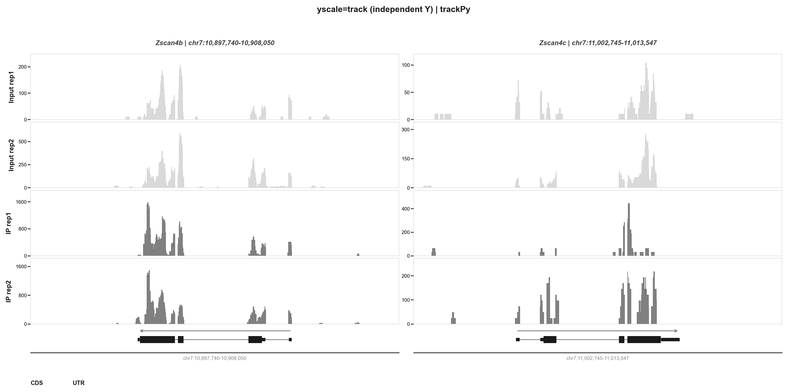

**`--ymax`** sets a fixed y-axis ceiling for all tracks (instead of auto-computed 99th percentile).

**Compact mode** (`--no-yticks` + `--no-range-label`):
```bash
trackpy plot faceted Zscan4b Zscan4c Zscan4d -g demo/testdata/Mus_musculus.GRCm38.102.gtf.gz \
  -b demo/testdata/GSM5746910_MS_2cell_Input_rep1.bigWig \
     demo/testdata/GSM5746911_MS_2cell_Input_rep2.bigWig \
     demo/testdata/GSM5746912_MS_2cell_IP_rep1.bigWig \
     demo/testdata/GSM5746913_MS_2cell_IP_rep2.bigWig \
  -l "Input rep1" "Input rep2" "IP rep1" "IP rep2" \
  --no-yticks --no-range-label --cytoband demo/cytoband/mm10_cytoBandIdeo.txt.gz \
  --show-box -o out
```

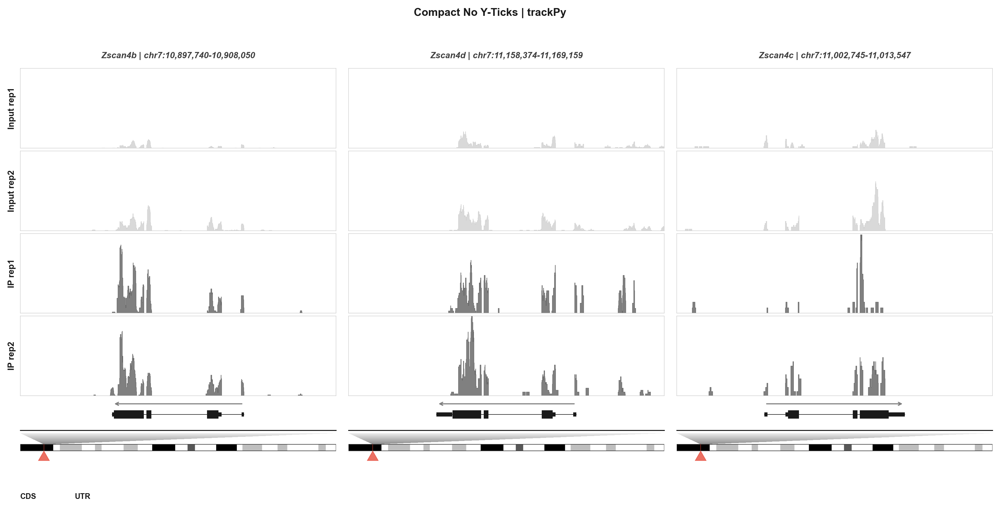

### 6.5 Flanking Region (`--flank-up`, `--flank-down`)

Control the padding around genes. Default is 3000 bp on each side.

```bash
# 10 kb flanking for wider genomic context
trackpy plot faceted Zscan4b -g demo/testdata/Mus_musculus.GRCm38.102.gtf.gz -b demo/testdata/GSM5746910_MS_2cell_Input_rep1.bigWig \
     demo/testdata/GSM5746911_MS_2cell_Input_rep2.bigWig \
     demo/testdata/GSM5746912_MS_2cell_IP_rep1.bigWig \
     demo/testdata/GSM5746913_MS_2cell_IP_rep2.bigWig \
  -l "Input rep1" "Input rep2" "IP rep1" "IP rep2" --flank-up 10000 --flank-down 10000 \
  --cytoband demo/cytoband/mm10_cytoBandIdeo.txt.gz --show-box -o out
```

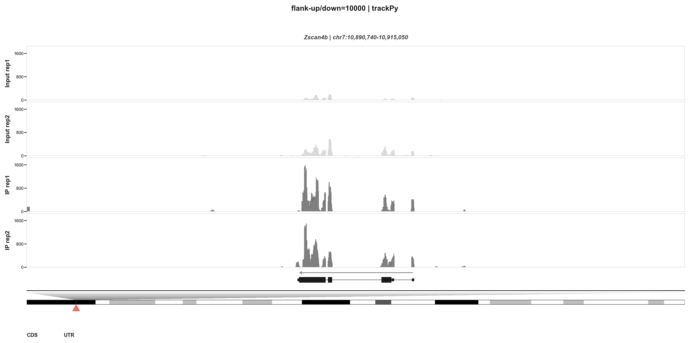

### 6.6 Gene Model Appearance

**`--gene-ratio`** controls the gene model panel height relative to signal tracks:

```bash
# Taller gene model (1.5x vs default 0.8x)
trackpy plot faceted Zscan4b Zscan4c \
  -g demo/testdata/Mus_musculus.GRCm38.102.gtf.gz \
  -b demo/testdata/GSM5746910_MS_2cell_Input_rep1.bigWig \
     demo/testdata/GSM5746911_MS_2cell_Input_rep2.bigWig \
     demo/testdata/GSM5746912_MS_2cell_IP_rep1.bigWig \
     demo/testdata/GSM5746913_MS_2cell_IP_rep2.bigWig \
  -l "Input rep1" "Input rep2" "IP rep1" "IP rep2" \
  --gene-ratio 1.5 --cytoband demo/cytoband/mm10_cytoBandIdeo.txt.gz \
  --show-box -o out
```

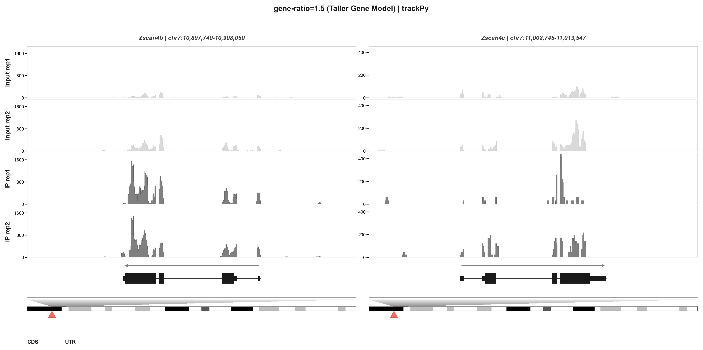

**`--utr-ratio`** controls UTR height relative to CDS (0.5 = UTR half the height of CDS).

**`--cds-color` / `--utr-color` / `--intron-color`** customize gene structure colors.

**`--gene-model-top`** places the gene model above signal tracks instead of below:

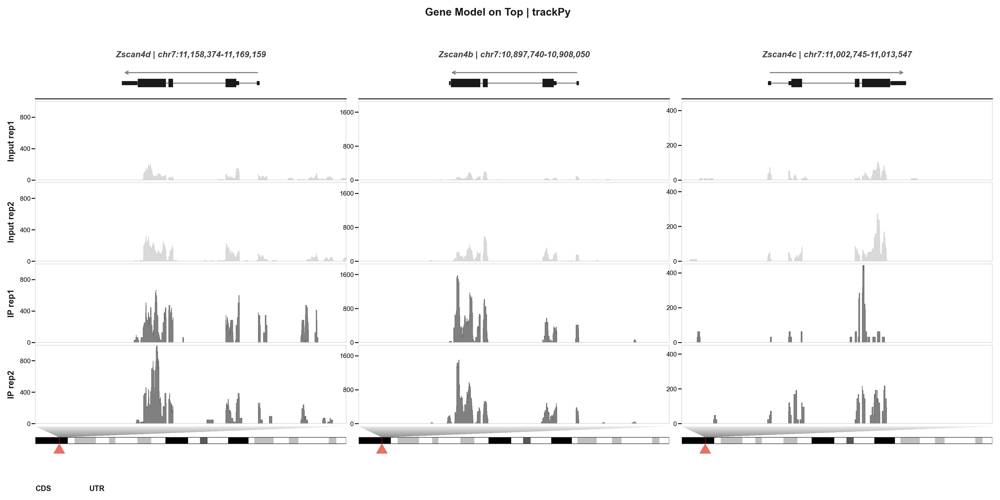

### 6.7 Isoform Display

**Label position** (`--isoform-label-pos`): control where transcript IDs appear.

| `left` | `right` |
|--------|---------|
| 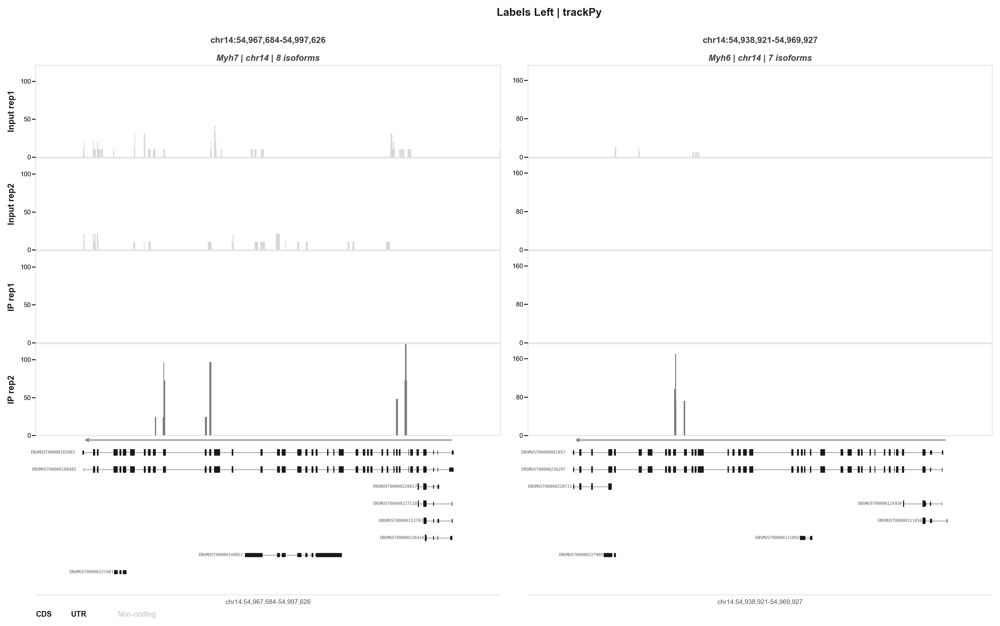 | 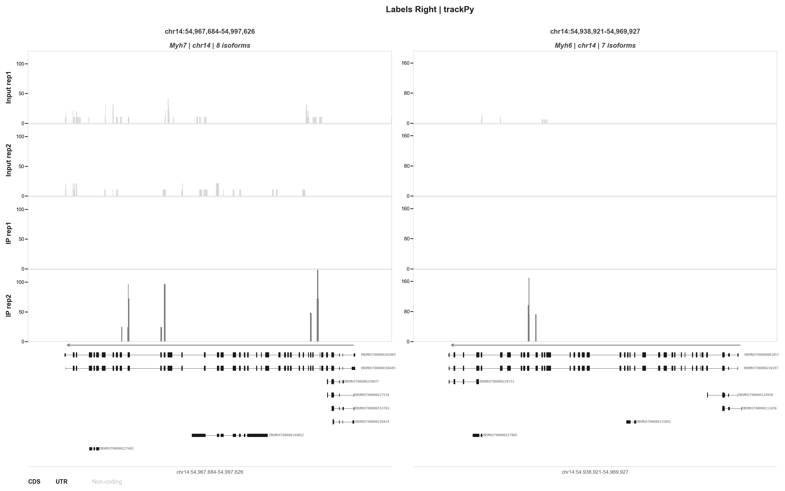 |

**`--isoform-height`**: controls row height (default `0.35`). Smaller = more compact.

**`--isoform-align`**: alignment of isoform rows within each column when genes have different transcript counts:
- `top` (default): rows start from the top
- `center`: rows centered vertically
- `bottom`: rows aligned to the bottom

**`--isoform-label-size`**: font size for transcript ID labels (default `6`).

**`--no-isoform-label`**: hide all transcript labels.

### 6.8 Layout Controls

| Flag | Effect |
|------|--------|
| `--width` / `--height` | Figure dimensions in inches |
| `--wspace` | Horizontal gap between columns (auto by default) |
| `--no-coords` | Hide the coordinate header row |
| `--show-box` | Draw border on all 4 sides of each track panel |

### 6.9 Zoom (`--zoom-region`, `--zoom-position`)

Magnify a sub-region within each gene. Works in `faceted` and `isoforms` modes (gene-name input only). Each gene column splits into full view + zoomed view, connected by a gradient trapezoid.

```bash
# Single zoom region (applies to all genes)
trackpy plot faceted Zscan4b -g genes.gtf -b in1.bw in2.bw ip1.bw ip2.bw \
  -l "Input rep1" "Input rep2" "IP rep1" "IP rep2" \
  --zoom-region 10903000-10905000 --show-box -o out
```


```bash
# Per-gene zoom regions (comma-separated)
trackpy plot isoforms Myh6 Myh7 -g genes.gtf -b in1.bw in2.bw ip1.bw ip2.bw \
  -l "Input rep1" "Input rep2" "IP rep1" "IP rep2" \
  --zoom-region "54940000-54960000,54970000-54990000" --show-box -o out
```


**Layout (--zoom-position bottom, default):**
```
┌──────────────────┐
│  Header          │
├──────────────────┤
│  Signal (full)   │  ← full gene view
├──────────────────┤
│  Gene model      │
│     ╲╱╲╱╲╱      │  ← trapezoid: narrow top (zoom region)
│    ╱╲╱╲╱╲╱     │               wide bottom (full panel)
├──────────────────┤
│  Signal (zoom)   │  ← zoomed region
├──────────────────┤
│  Gene model      │
└──────────────────┘
```

**Parameters:**

| Flag | Default | Description |
|------|---------|-------------|
| `--zoom-region` | — | `START-END` pairs, comma-separated. One per gene; single value = all genes. |
| `--zoom-position` | `bottom` | `bottom` = full above, zoom below. `top` = zoom above, full below. |
| `--trap-color` | `#E0E0E0 #404040` | Shared trapezoid gradient colors (also controls cytoband trapezoid) |

---

## 8. Recipes

### 8.1 Basic gene panel with ideogram
```bash
trackpy plot faceted Myc Jun Actb \
  -g demo/testdata/Mus_musculus.GRCm38.102.gtf.gz -b input.bw ip.bw -l Input IP \
  --cytoband demo/cytoband/mm10_cytoBandIdeo.txt.gz --show-box -o panel
```

### 8.2 lncRNA isoform browser
```bash
trackpy plot isoforms Malat1 Xist H19 Airn Hotair \
  -g demo/testdata/Mus_musculus.GRCm38.102.gtf.gz -b input.bw ip.bw -l Input IP \
  --show-box --isoform-label-pos left -o lncRNA
```

### 8.3 Explore a genomic interval (all transcripts)
```bash
trackpy plot regions chr14:54835580-55001465 \
  -g demo/testdata/Mus_musculus.GRCm38.102.gtf.gz -b input.bw ip.bw -l Input IP \
  --show-box --cytoband demo/cytoband/mm10_cytoBandIdeo.txt.gz -o my_region
```

### 8.4 Faceted region comparison
```bash
trackpy plot faceted chr14:54835580-55001465 chr7:73025897-76116527 \
  -g demo/testdata/Mus_musculus.GRCm38.102.gtf.gz -b input.bw ip.bw -l Input IP \
  --show-box --width 10 -o compare_regions
```

### 8.5 Custom track colors
```bash
trackpy plot faceted Myc Jun -g demo/testdata/Mus_musculus.GRCm38.102.gtf.gz -b wt.bw ko.bw -l WT KO \
  --track-colors "#3498DB" "#E74C3C" -o custom_colors
```

### 8.6 Highlight specific regions
```bash
trackpy plot faceted Myc -g demo/testdata/Mus_musculus.GRCm38.102.gtf.gz -b input.bw ip.bw -l Input IP \
  --highlight chr15:61900000-61901000 "#FF000020" \
  --highlight chr15:61902000-61903000 "#0000FF20" -o highlights
```

### 8.7 BedGraph (ATAC-seq) input
```bash
trackpy plot faceted Actb Myc -g demo/testdata/Mus_musculus.GRCm38.102.gtf.gz \
  -b wt.bedgraph.gz ko.bedgraph.gz -l WT KO \
  --track-colors "#3498DB" "#E74C3C" -o atac
```

### 8.8 Compact layout (no y-ticks, no range labels)
```bash
trackpy plot faceted Myc Jun Actb -g demo/testdata/Mus_musculus.GRCm38.102.gtf.gz -b a.bw b.bw -l A B \
  --no-yticks --no-range-label --cytoband demo/cytoband/mm10_cytoBandIdeo.txt.gz -o compact
```

### 8.9 Gene model on top

```bash
trackpy plot faceted Zscan4b Zscan4c Zscan4d \
  -g demo/testdata/Mus_musculus.GRCm38.102.gtf.gz \
  -b demo/testdata/GSM5746910_MS_2cell_Input_rep1.bigWig \
     demo/testdata/GSM5746911_MS_2cell_Input_rep2.bigWig \
     demo/testdata/GSM5746912_MS_2cell_IP_rep1.bigWig \
     demo/testdata/GSM5746913_MS_2cell_IP_rep2.bigWig \
  -l "Input rep1" "Input rep2" "IP rep1" "IP rep2" \
  --gene-model-top --cytoband demo/cytoband/mm10_cytoBandIdeo.txt.gz \
  --show-box -o top
```


### 8.10 lncRNA panel

```bash
trackpy plot faceted Malat1 Xist H19 Airn Hotair \
  -g demo/testdata/Mus_musculus.GRCm38.102.gtf.gz -b demo/testdata/GSM5746910_MS_2cell_Input_rep1.bigWig \
     demo/testdata/GSM5746911_MS_2cell_Input_rep2.bigWig \
     demo/testdata/GSM5746912_MS_2cell_IP_rep1.bigWig \
     demo/testdata/GSM5746913_MS_2cell_IP_rep2.bigWig \
  -l "Input rep1" "Input rep2" "IP rep1" "IP rep2" \
  --cytoband demo/cytoband/mm10_cytoBandIdeo.txt.gz --show-box -o lncRNA
```

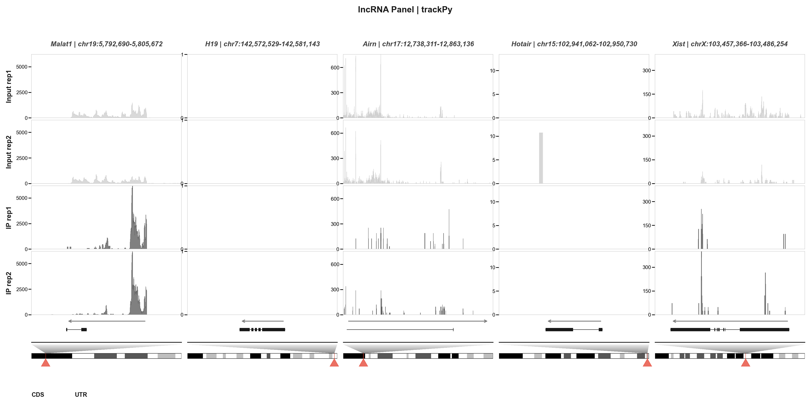

---

## 9. Python API

```python
from trackpy import (
    BigWigReader, BedGraphReader,
    parse_annotations, load_gene_data,
    parse_regions, parse_faceted_regions,
    plot_faceted, plot_isoforms, plot_isoforms_regions,
    IGV_COLORS,
)

# ── Gene-name based ──────────────────────────────
genes = parse_annotations("genes.gtf.gz", ["Zscan4b", "Myc"])
data = load_gene_data(genes, {"Input": "in.bw", "IP": "ip.bw"})

plot_faceted(genes, data, ["Input", "IP"], data, IGV_COLORS,
             "faceted.pdf", cytoband="mm10_cytoBandIdeo.txt.gz", show_box=True)

plot_isoforms(genes, data, ["Input", "IP"], data, IGV_COLORS,
              "isoforms.pdf", show_box=True)

# ── Region-based ─────────────────────────────────
regions = [("7", 10900000, 11000000, "chr7:10.9-11.0Mb"),
           ("19", 5790000, 5810000, "chr19:5.79-5.81Mb")]

regions_data = parse_regions("genes.gtf.gz", regions)
plot_isoforms_regions(regions_data, data, ["Input", "IP"], {}, IGV_COLORS,
                      "regions.pdf", show_box=True)

faceted_data = parse_faceted_regions("genes.gtf.gz", regions)
plot_faceted(faceted_data, data, ["Input", "IP"], {}, IGV_COLORS,
             "faceted_regions.pdf", show_box=True)

# ── Low-level I/O ────────────────────────────────
with BigWigReader("signal.bw") as bw:
    print(bw.chromosomes)
    values = bw.query("chr7", 10900000, 11000000)

reader = BedGraphReader("signal.bedgraph.gz")
values = reader.query("chr7", 10900000, 11000000)
```

---

## License

MIT — [https://github.com/junjunlab/trackPy](https://github.com/junjunlab/trackPy)
